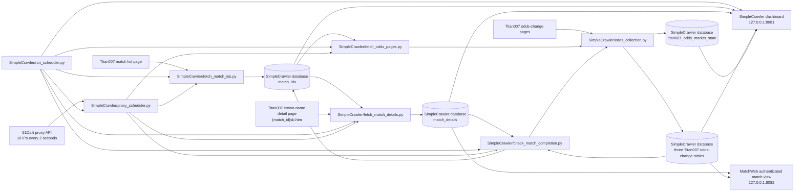

# Football2607 Code Flow

This document is the maintained map of the project's runtime logic. Update it in
the same change whenever workflows, background-task scheduling, data ownership,
database schemas, provider interfaces, or CLI entry points change.

## System overview

## Entrypoints

| Command | Python entrypoint | Purpose | Persistent write |
| --- | --- | --- | --- |
| `start_all.bat` | Windows launcher for `SimpleCrawler/run_scheduler.py:main` and `MatchWeb/server.py:main` | Start the crawler supervisor and authenticated match view in separate command windows, preferring the repository `.venv` | None directly; the launched crawler jobs own their writes |
| `python3 SimpleCrawler/run_scheduler.py` | `SimpleCrawler/run_scheduler.py:main` | Run the proxy service and the four independent, single-instance crawler loops | None directly; child jobs own their writes |
| `python3 SimpleCrawler/fetch_match_ids.py` | `SimpleCrawler/fetch_match_ids.py:main` | Fetch the currently rendered Titan007 match IDs, print them, and store unseen IDs | Dedicated PostgreSQL database configured by `SIMPLE_CRAWLER_DATABASE_URL` |
| `python3 SimpleCrawler/fetch_match_details.py [match_id ...]` | `SimpleCrawler/fetch_match_details.py:main` | Fetch and store detail-page fields for selected IDs or every database ID | Dedicated PostgreSQL database configured by `SIMPLE_CRAWLER_DATABASE_URL` |
| `python3 SimpleCrawler/fetch_odds_pages.py [match_id ...]` | `SimpleCrawler/fetch_odds_pages.py:main` | Fetch, parse, and store three odds markets for each configured company and selected match | Three odds-change tables and `titan007_odds_market_state` in the dedicated PostgreSQL database |
| `python3 SimpleCrawler/check_match_completion.py` | `SimpleCrawler/check_match_completion.py:main` | Persist resumable 18-page final snapshots for matches whose finished detail has been stable for five minutes or whose kickoff is more than four hours old | Three odds-change tables, `titan007_odds_market_state`, and `match_ids.crawl_status` |
| `python3 SimpleCrawler/proxy_scheduler.py` | `SimpleCrawler/proxy_scheduler.py:main` | Run the single localhost proxy-pool and lease service | In-memory proxy and lease state |
| `python3 MatchWeb/server.py` | `MatchWeb/server.py:main` | Serve the authenticated, read-only match list with date/status filters and 60-second browser refresh | None |
| `python3 MatchWeb/manage_users.py add\|remove\|list` | `MatchWeb/manage_users.py:main` | Maintain local MatchWeb login accounts with interactively entered, salted password hashes | `MatchWeb/users.json` (or `MATCH_WEB_USERS_FILE`) |

## Authenticated match view

On Windows, `start_all.bat` at the repository root provides the combined launcher.
It resolves the repository from the batch file location, prefers
`.venv\Scripts\python.exe`, falls back to the Python launcher or `python` on
`PATH`, and starts the crawler supervisor and MatchWeb in separate command
windows. The Python entrypoints remain independently usable and retain ownership
of their own validation, lifecycle, and shutdown behavior.

`MatchWeb/server.py` is an independently started, read-only presentation service.
It loads the same `SIMPLE_CRAWLER_DATABASE_URL` used by the crawler, accepts a
Shanghai-calendar date and one of four presentation status groups, then reads
`match_details`. The status groups preserve the dashboard domain
rules: minute/phase values are presented as in progress, `未开始` and `完` are
exact groups, and every remaining source status is grouped as other. No crawler
schedule or persisted record is changed.

The optional odds predicate is enabled by default. It keeps matches where either
handicap side (`home_odds` or `away_odds`) or the over price (`over_odds`) has
ever been below `0.700` on a non-`滚` record, and independently requires at least one company-3 row
in any of the handicap, one-x-two, or over-under change tables. Disabling the
checkbox omits both odds predicates.
The same non-rolling low-price records are aggregated per match for the filter
marker column. The API maps each stored company ID through the crawler-owned
company-name configuration and returns the company name with its `change_time`;
the browser exposes those values on marker hover and keyboard focus.

All HTML and JSON match routes require a server-validated, HMAC-signed login
session. Multiple local accounts are stored in a separately managed JSON file;
passwords use salted PBKDF2-SHA256 hashes and are never stored as plaintext.
The authenticated `/users` page and `/api/users` management endpoints additionally
require the signed session username to be exactly `admin`. They list accounts and
allow the administrator to create users, reset passwords, and delete non-admin
accounts. Each mutation validates input, hashes new passwords, and atomically
replaces the same account JSON file; deleting the `admin` account is rejected.
The in-process account map is updated together with the file, so changes take effect
immediately without restarting MatchWeb. Non-admin sessions receive HTTP 403 from
these routes, and the browser only reveals the user-management navigation after a
server-reported admin session check.
After the first query, the browser repeats the same read-only request every 60
seconds. Match IDs link to Nowscore's company-3 three-market odds page.

## Standalone match-ID discovery

`SimpleCrawler/run_scheduler.py` is the long-running supervisor for the standalone
crawler. A non-blocking process lock allows only one supervisor instance. It reuses
an already healthy proxy lease service or starts `proxy_scheduler.py`, then starts
four independent worker threads and one proxy-health sampling thread. The sampler
queries the proxy service `/health` endpoint every ten seconds, stores the pool,
lease, availability, quarantine, page-slot, received, validated, and validation-rate
values in the process-local dashboard snapshot, and also appends a readable summary
to the proxy log. A failed sample preserves the last values while attaching the
health-check error and marking that panel unhealthy until the next successful sample.
Each worker runs its existing one-shot script as
a child process, captures its merged stdout/stderr while preserving prefixed terminal
output, waits for that child to finish, waits its post-round interval, and
only then starts the next round. Consequently, a slow round never overlaps the next
round of the same job, and no `--limit` is passed by the supervisor. Child processes
inherit the parent environment, and SimpleCrawler is independently installable
from its own `pyproject.toml`. The supervisor lock uses the shared `portalocker`-
backed file-lock adapter, so the same single-instance behavior applies on Windows,
Linux, and macOS.

After database selection, the detail, ordinary odds, and completion entrypoints
emit one shared `本轮比赛数量：N 场` monitor marker, including `N = 0`. The
supervisor parses that marker from the already captured output into the component's
process-local `round_match_count`; it resets the value at the start of every round.
The dashboard shows the count only for components that emit the marker. This output
contract carries presentation metadata only and does not affect selection or job
scheduling.

The supervisor also owns a read-only human dashboard on `127.0.0.1:8081` by
default. `/` renders separate panels for the proxy service and all four jobs;
`/api/status` returns their current state, latest timing and exit information, and
the most recent 400 log lines per component. A separate read-only sampler queries
PostgreSQL every ten seconds for matches whose parsed scheduled date is today in
Asia/Shanghai. It publishes the match-ID count, finished count (`status_text =
'完'`), in-progress count (live phase or minute `status_text`), today's completed,
abnormal, and paused crawl-status counts, the total and unfinished counts for
matches scheduled before today, and the stored odds change record count for every
company and market. Detail rows whose scheduled-time text does not match the
supported `YYYY-MM-DD HH:MM` format are published separately as invalid times.
The dashboard presents today and history in parallel columns with exhaustive known
match-state and crawl-state buckets, plus finished-but-unfinished cross-state
counts. Each date column also subdivides `crawl_status = '未完成'` by the same seven
match-state buckets, so the unfinished total can be attributed to match lifecycle
state without changing the crawler status model. Match IDs without a detail row are
reported only as a missing-detail data quality count because they cannot yet be
assigned to a scheduled-date column.
The same read-only snapshot publishes an operational backlog: missing details,
matches currently eligible for ordinary odds collection, finished matches still
awaiting completion, pending final market pages, and the oldest unfinished match.
It also returns at most 20 prioritized problem matches covering missing or invalid
details, terminal crawl states, finished-but-unfinished matches, and the latest
persisted market-page error. The dashboard renders these values as a compact backlog
panel, a structured proxy panel, and a problem table. A browser-side alert strip
combines component failures, database or proxy errors, terminal match counts,
finished backlog, missing details, invalid times, and zero proxy availability; it
does not create a separate alert store or change crawler scheduling.
Database failures are shown in the summary while the last successful values remain
available. The browser polls
the process-local snapshot once per second and auto-scrolls active logs.
`SIMPLE_CRAWLER_MONITOR_HOST` changes the bind address,
and `SIMPLE_CRAWLER_MONITOR_PORT=0` disables HTTP. State and logs are process-local
and disappear when the supervisor stops. An externally managed proxy service has
health state but only supervisor lifecycle messages because its stdout is not owned
by this process.

The default post-round intervals are 15 minutes for match-ID discovery, 5 seconds
for details, 5 seconds for odds, and 60 seconds for completion checks. They can be
overridden with `SIMPLE_CRAWLER_ID_INTERVAL_SECONDS`,
`SIMPLE_CRAWLER_DETAIL_INTERVAL_SECONDS`,
`SIMPLE_CRAWLER_ODDS_INTERVAL_SECONDS`, and
`SIMPLE_CRAWLER_COMPLETION_INTERVAL_SECONDS`. Odds and completion workers do not
share a lock and may run concurrently, but their per-match windows are disjoint:
ordinary odds owns minus four hours through plus 30 minutes until a finished detail
has been stable for five minutes, while finalization owns those stable finished
matches plus any match more than four hours after kickoff. Both call the shared collection
module directly; completion does not spawn an odds child. SIGINT or SIGTERM stops active children and the
proxy service started by the supervisor. An independently managed healthy proxy
service is reused and left running.

`SimpleCrawler/fetch_match_ids.py` remains a one-shot entrypoint. It launches one
Chromium browser and makes at most three same-round attempts to receive
`vbsxml/bfdata_ut.js` while navigating `oldIndexall.aspx`. Images, stylesheets,
media, and fonts are blocked; scripts and XHR remain enabled because the page's
startup chain triggers the data request. The worker parses the first field of each
`A[n]` assignment directly from the response text and requires the unique ID count
to equal the source `matchcount`. It neither waits for rendered `tr1_<match_id>`
rows nor queries the DOM. The first attempt and two retries each use a fresh proxy
lease and browser context. A navigation, response, format, or count exception closes the context,
releases the lease as failed so that proxy is quarantined, and immediately obtains a
different proxy; success stops the retry loop. Only after all three attempts fail
does the one-shot command return a failure for the supervisor's normal 15-minute
post-round wait. A successful attempt prints the unique positive IDs in ascending
order, inserts unseen IDs into its dedicated PostgreSQL database, and exits.

The connection string comes only from `SIMPLE_CRAWLER_DATABASE_URL` in
`SimpleCrawler/.env`. The script creates `match_ids` on first use. Its `match_id`
column is the primary key, so repeated list fetches use `ON CONFLICT DO NOTHING`
and preserve the original `created_at` discovery time. `crawl_status` defaults to
`未完成` and is restricted to `未完成`, `已完成`, `暂停爬取`, or `异常`;
completion checks update it together with `updated_at`.

All standalone scripts take their persistent defaults from `SimpleCrawler/.env`.
`SIMPLE_CRAWLER_ACTIVE_CRAWL_STATUSES` is a comma-separated scope shared by the
normal detail and odds scripts and defaults to only `未完成`. Database-wide detail
selection is filtered through this scope, while explicitly supplied detail IDs
bypass it. Odds selection, including explicitly supplied odds IDs, remains filtered
through the configured scope.
Finalization is stricter and selects only `未完成`; `暂停爬取`, `异常`, and
`已完成` are terminal for automatic finalization and require an explicit reset to
`未完成` before they can run again. The match-list script only discovers IDs and
inserts unseen rows as `未完成`; conflicts preserve the existing status.
The file configures the list and detail URLs, per-step timeouts, a retained but
unused legacy list-settle value,
optional detail limit, detail and odds page concurrency, headed mode, and mandatory
proxy supplier credentials. Explicit command line arguments override environment
defaults; `--headed` and `--headless` can override the configured browser mode in
either direction.

Every standalone network page must acquire a lease from
`SimpleCrawler/proxy_scheduler.py`; direct and fixed-proxy modes are not available.
The scheduler is one long-running localhost HTTP service and is the only process
that calls the supplier. It calls immediately and then every 1.6 seconds by default; each
response contributes up to ten `host:port` addresses to the one shared in-memory
pool only after validation. The ten candidates are checked concurrently through
their authenticated HTTPS proxy against `PROXY_TEST_URL`; only a 2xx or 3xx
response enters the pool. `/health` reports the latest received and validated
counts, distinct available and quarantined proxies, and remaining page-assignment slots. An
address expires 30 seconds after its supplier request started and may be assigned
to at most `PROXY_MAX_PAGE_ASSIGNMENTS_PER_IP` pages across all crawler processes
(default 5), including concurrent browser contexts. A lease may atomically reserve
more than one slot when one context will make several page requests; odds company
jobs reserve one slot per requested market. The final allowed assignment
quarantines that address for `PROXY_RETIRE_SECONDS` (default one hour); an earlier
page exception starts the same quarantine immediately. Existing concurrent pages
may finish, but releases never restore consumed assignment slots. Supplier responses
cannot re-add an address during its quarantine. Expiry only clears its exclusion and
assignment history: the old endpoint is never restored automatically. The supplier
must return the same `host:port` again after quarantine, and it must pass validation
again before it enters the available pool as a newly issued endpoint.
Expired addresses and abandoned leases are reaped before another allocation. A
lease request waits up to five seconds by default when no suitable proxy is
available.
The supplier request timestamp is protected by the same cross-platform exclusive
file-lock adapter, so independently started proxy-scheduler processes share the
configured API minimum interval on Windows, Linux, and macOS.

The list, detail, odds, and completion scripts are lease clients only. They call
the configured `PROXY_SCHEDULER_URL` for `/lease` and `/release`. List and detail
attempts create a fresh proxy-bound Chromium context for each page; odds and
completion create one per match-company task and reuse it across that company's
requested markets. They never read
`PROXY_API_URL`, never maintain a local pool, and fail instead of crawling when
the central service is unavailable. Start `proxy_scheduler.py` before any crawler.

`SimpleCrawler/fetch_match_details.py` reads IDs from the same database. With
positional IDs it inserts unseen IDs and force-refreshes every requested ID without
checking `crawl_status`; this explicit mode bypasses the normal detail-age and
kickoff-window filters without changing the stored crawl status. Without positional IDs, missing details are
selected first. Existing details are selected only when the page status is not
`完`, the last update is at least one minute old, and the Asia/Shanghai kickoff
is between four hours ago and 30 minutes from now. Existing details with an
unparseable kickoff are also retried at the one-minute cadence so bad source data
can recover. Finished matches, parseable matches more than 30 minutes before
kickoff, and matches more than four hours after kickoff do not enter the normal
detail queue. `--limit` optionally bounds either mode. One Chromium browser is
reused by a bounded worker queue. Up to
`SIMPLE_CRAWLER_DETAIL_CONCURRENCY` matches are active at once (default 2), and
each concurrency slot makes at most three attempts for its current match. Every
attempt receives a fresh proxy lease, browser context, and page. A failed page
quarantines that proxy and immediately retries the same match up to two times without
waiting for the next supervisor round; success stops the retry loop. Scripts
remain enabled because the detail page uses them to populate score and status;
styles, images, media, and fonts are blocked. Results are handled in completion
order by one database connection. Successful details are committed individually,
so one match exhausting all three attempts does not discard other work.

The standalone `match_details` table owns league, home and away team, original
scheduled-time text, optional scores, and page status. `match_id` is both its
primary key and a cascading foreign key to `match_ids`; `created_at` records the
first successful detail fetch and conflict updates refresh `updated_at`.

`SimpleCrawler/fetch_odds_pages.py` joins active-status `match_ids` to
`match_details` and selects only matches whose parseable Asia/Shanghai scheduled
time is between four hours ago and 30 minutes from now. A finished match remains in
ordinary polling for five minutes after its latest detail update, then leaves the
ordinary queue for finalization. The script orders active not-finished matches
first, upcoming matches second, and recently finished matches third. Positional IDs and
`SIMPLE_CRAWLER_ODDS_MATCH_LIMIT` may further restrict the run, but positional IDs
cannot bypass either the active-status or scheduled-time filter. Company IDs are
configured as a comma-separated list. Every match-company combination is one
bounded queue job containing the three market pages. One Chromium browser runs up to
`SIMPLE_CRAWLER_ODDS_PAGE_CONCURRENCY` company jobs at once (default 12); every active job
calls the async adapter in `SimpleCrawler/odds_collection.py`. The shared module
owns page identity, URL construction, one proxy lease and browser context per
company attempt, sequential market navigation inside that context, response
validation, server-rendered main-document HTML parsing, domain
parsing, three-market persistence SQL, and page-state persistence. The browser
provides the network fingerprint without waiting for or querying the rendered DOM.
Odds contexts block scripts, stylesheets, images, media, and fonts because all
three market tables are complete in the main document response. This invariant was
verified against real 亚让, 胜平负, and 进球数 pages by comparing every
raw cell and every parsed domain field with scripts enabled and blocked.
Each lease reserves the number of proxy page slots equal to its requested markets.
Match-company collection requires only a one-second current-validity window when
acquiring a lease; it does not multiply per-page navigation timeouts into a
predicted lease duration. Short-lived proxies are used immediately, and existing
per-market outcomes recover from expiry by retaining successes and retrying only
failed final markets.
One market failure quarantines that proxy but does not discard sibling-market successes.
Parsed results return to the entrypoint in company completion order and are written
serially through one database connection. Each successful page is committed
independently. Parsed `赔率变动记录` values are sent
to PostgreSQL in batches of 500. Conflict updates use null-safe whole-row value
comparison and run only when persisted scores, market values, movement, source
status, or suspension state differ; unchanged history rows preserve their existing
`updated_at` instead of generating another row version. In the same transaction as
each successful page, the shared module calls `odds_market_state.py` to upsert one
`titan007_odds_market_state` row keyed by match, company, and market. It records
the attempt and success times, successful status, parsed `赔率变动记录` count,
and a SHA-256 digest of canonical parsed values. A fetch, parse, or persistence
failure is committed separately with its attempt time and error while preserving
the last successful count, digest, and timestamp. `final_required` defaults to
false and `final_success_at` remains null in ordinary collection. Finalization sets
`final_required` for all 18 pages and records `final_success_at` in the same
transaction as each successful final page.

The partial index on rows where `final_required` is true and `final_success_at` is
null supports finalization work selection without scanning successful ordinary
pages. The state module owns status invariants and digest construction behind the
single `record_market_result` interface; crawler control flow does not construct
state-table SQL or hashes.

`SimpleCrawler/check_match_completion.py` uses the asynchronous adapter of that
same module with the shared global company-concurrency setting (default 12). Up to
two matches enter finalization concurrently by default, while one semaphore across
all active matches prevents their company jobs from multiplying the configured
network concurrency. Its first attempt groups pending pages by company and reuses
one context across that subset. Each company's market outcomes persist together in
one transaction; successful pages leave the retry set, while the second and third
attempts group and request only markets that failed, each with a fresh lease and
context. Later rounds likewise select only failed or unattempted pages. The final
company scope is always all six supported companies, independent
of a reduced ordinary `SIMPLE_CRAWLER_ODDS_COMPANY_IDS` setting.

The standalone odds script owns its parser and field model under
`SimpleCrawler/simple_crawler`. The local company-name mapping lives in
`simple_crawler/companies.py`; odds and
completion logs render both ID and name from this single interface. Every child
job prefixes output with its scheduler task name so interleaved concurrent logs
remain attributable. It
writes 亚让 to `titan007_handicap_changes`, 胜平负 to
`titan007_1x2_changes`, and 进球数 to `titan007_over_under_changes`. Source-table
order is reversed into stable `seq` values, scores are split, red/green/no-color becomes
上升/下降/不变, 封 rows use null market fields, and raw plus numeric line values are
preserved. The state table drives resumable final-page selection but does not yet
schedule ordinary polling intervals.
Before parsing, the script rejects HTTP errors and pages containing access-denied,
WAF, or CAPTCHA markers. A page without the target table is accepted as a valid
empty market only when the odds shell or market navigation is present; otherwise
it is a failure.

`SimpleCrawler/check_match_completion.py` remains one-shot; the supervisor provides
its 60-second post-round interval. It selects matches whose detail status has been
`完` and unchanged for at least five minutes, plus parseable matches more than four
hours after kickoff as a stale-status fallback. Postponed, cancelled, or pending matches use
the same overdue fallback only when their detail row has not been refreshed for
seven days; a refresh that leaves either status unchanged starts a new seven-day
cooldown. Finished matches are prioritized,
followed by more recent parseable kickoffs. All overdue non-finished matches in the
round are passed to one forced detail child process, which reuses its browser and
bounded detail workers. The child runs Python in unbuffered mode so both successful
stdout records and failure stderr records reach the completion log immediately.
Playwright exceptions are reduced to their actionable first line instead of
repeating the multi-line call log, and detail workers publish a success/failure/
active progress summary every ten completed matches and at the end of the batch.
One bulk database recheck then keeps only matches whose
refreshed detail says `完`; the others remain `未完成` and request no final odds
pages. The worker creates any missing state rows for the fixed six-company by
three-market final snapshot with one set-based statement and selects only pages
whose final success time is still null. Up to two matches run concurrently by
default, configurable through `SIMPLE_CRAWLER_COMPLETION_MATCH_CONCURRENCY` or
`--match-concurrency`, but their company requests share the global
`SIMPLE_CRAWLER_ODDS_PAGE_CONCURRENCY` limiter. A hard 180-second per-match timer is
configurable via `SIMPLE_CRAWLER_COMPLETION_MATCH_TIMEOUT_SECONDS` or
`--match-timeout`. Successful
pages are parsed and persisted through `odds_collection.py`; failures and timeout
leave pending page state. After each match, the worker counts cumulative final
successes across all rounds and assigns `未完成` for 0-3 pages, `异常` for 4-6,
`暂停爬取` for 7-17, or `已完成` for all 18. Only `未完成` remains eligible for
the next automatic round; the other outcomes are terminal until manually reset.
It no longer re-fetches pages solely to compare row counts or spawns
`fetch_odds_pages.py`.

## Module map

| Module | Responsibility |
| --- | --- |
| `SimpleCrawler/simple_crawler/companies.py` | Standalone Titan007 company IDs, names, and log labels |
| `SimpleCrawler/simple_crawler/file_lock.py` | Cross-platform exclusive process file locks backed by `portalocker` |
| `SimpleCrawler/simple_crawler/models.py` | Standalone odds-change domain values |
| `SimpleCrawler/simple_crawler/odds_parser.py` | Standalone Titan007 row validation and three-market parsing |
| `SimpleCrawler/simple_crawler/monitoring.py` | Bounded runtime state plus the local monitoring dashboard and JSON endpoint |
| `SimpleCrawler/odds_market_state.py` | Per-page latest attempt, success, count, digest, and error state |
| `SimpleCrawler/odds_collection.py` | Shared match-company collection, context reuse, response-HTML parsing, three-market persistence, and page-state transactions |
| `SimpleCrawler/fetch_match_ids.py` | Match-list discovery and `match_ids` persistence |
| `SimpleCrawler/fetch_match_details.py` | Detail-page selection, collection, and `match_details` persistence |
| `SimpleCrawler/fetch_odds_pages.py` | Odds-page selection, bounded async orchestration, logging, and exit-code aggregation |
| `SimpleCrawler/check_match_completion.py` | Batched overdue detail refresh, globally bounded concurrent 18-page finalization, and crawl-status update |
| `SimpleCrawler/proxy_scheduler.py` | Shared proxy pool, validation, leasing, quarantine, and health endpoint |
| `SimpleCrawler/run_scheduler.py` | Process supervision, task intervals, lifecycle, and dashboard composition |
| `SimpleCrawler/pyproject.toml` | SimpleCrawler package metadata and complete runtime dependency declaration |

## Documentation update checklist

Update this file whenever a change affects any of the following:

- a CLI command or entrypoint;
- a provider URL, selector, field mapping, or concurrency rule;
- task ordering, timing, retry, batching, or completion behavior;
- which task owns a database field;
- a table, column, constraint, index, or relationship;
- odds markets, companies, parsing rules, or persistence behavior.

When updating, revise the diagrams, tables, and operational constraints—not only
the prose description.
