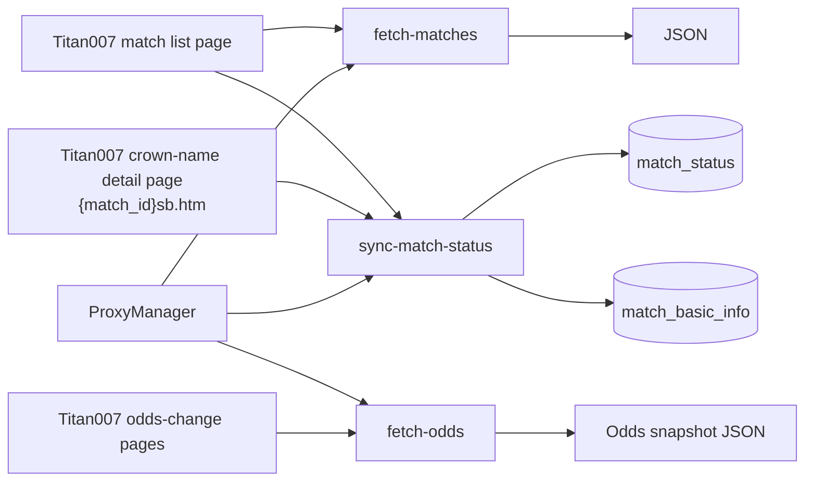
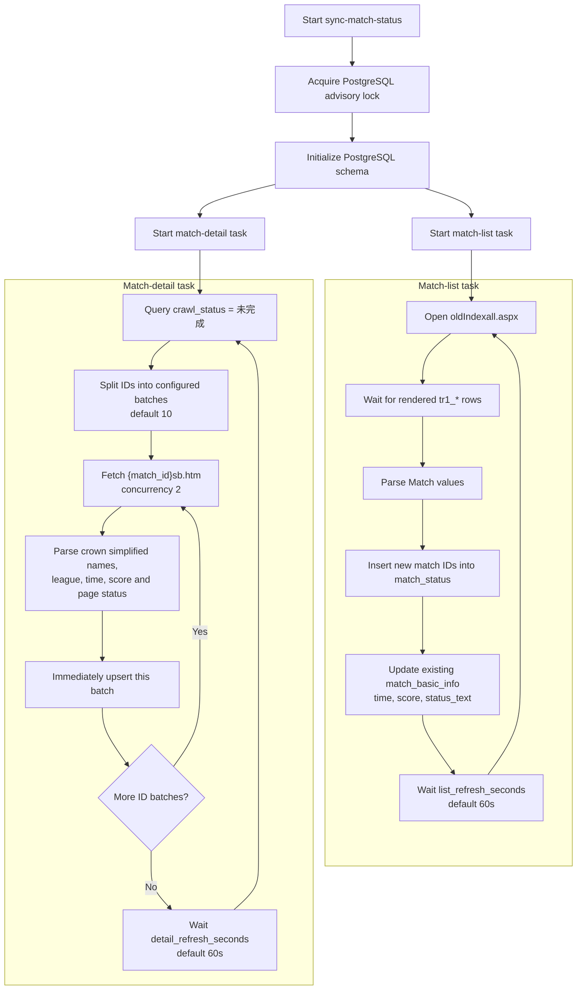
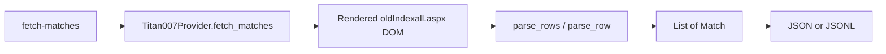
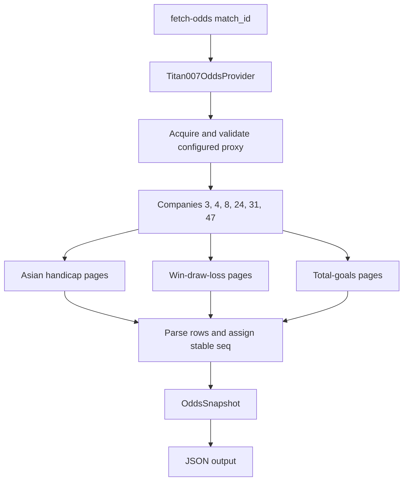

# Football2607 Code Flow

This document is the maintained map of the project's runtime logic. Update it in
the same change whenever workflows, background-task scheduling, data ownership,
database schemas, provider interfaces, or CLI entry points change.

## System overview



## Entrypoints

| Command | Python entrypoint | Purpose | Persistent write |
| --- | --- | --- | --- |
| `fetch-matches` | `fetch_data.cli:main` | Fetch one rendered match-list snapshot | No |
| `sync-match-status` | `fetch_data.status_cli:main` | Continuously synchronize match IDs and match information | PostgreSQL |
| `fetch-odds` | `fetch_data.odds_cli:main` | Fetch three odds markets for one match and selected companies | No; JSON output only |

## Continuous match synchronization

`MatchSynchronizer` starts two independent tasks. A slow detail crawl does not
await or schedule the list refresh task.



### Field ownership

The two tasks deliberately own different updates so they do not overwrite one
another.

| Field | Initial insert | Subsequent owner |
| --- | --- | --- |
| `match_id` | Match-list task | Match-list task discovers new IDs |
| `crawl_status` | Database default `未完成` | Completion rule is not implemented yet |
| `source` | Detail task | Detail task |
| `league` | Detail task | Detail task |
| `home_team` / `away_team` | Detail task from `sb.htm` | Detail task |
| `scheduled_time` | Detail task initially | Match-list task |
| `home_score` / `away_score` | Detail task initially | Match-list task |
| `status_text` | Detail task initially | Match-list task |
| `updated_at` | Database default | Either successful update |

The detail task does not change `crawl_status` to `已完成`. The completion rule
will be defined separately.

## Database schema

### `match_status`

This table is the match-ID and crawl-work queue. It does not store the football
match's current status.

```sql
CREATE TABLE match_status (
    match_id BIGINT PRIMARY KEY,
    crawl_status TEXT NOT NULL DEFAULT '未完成'
        CHECK (crawl_status IN ('未完成', '已完成'))
);
```

### `match_basic_info`

```sql
CREATE TABLE match_basic_info (
    match_id BIGINT PRIMARY KEY
        REFERENCES match_status(match_id) ON DELETE CASCADE,
    source TEXT NOT NULL,
    league TEXT NOT NULL,
    home_team TEXT NOT NULL,
    away_team TEXT NOT NULL,
    scheduled_time TEXT NOT NULL,
    home_score SMALLINT,
    away_score SMALLINT,
    status_text TEXT NOT NULL,
    updated_at TIMESTAMPTZ NOT NULL DEFAULT NOW()
);
```

## One-shot match-list flow



Invalid rows and duplicate match IDs are ignored. Page status text is preserved,
and a normalized `MatchStatus` is also produced for one-shot JSON consumers.
The command always emits one formatted JSON array and uses the provider's fixed
30-second page timeout; output-format and timeout CLI options are not exposed.

## Odds-change flow

For one match, the default request set is six companies multiplied by three
markets, for 18 pages.



The current odds command does not write to PostgreSQL. Detailed field and DOM
rules are maintained in `docs/data-sources/titan007-odds-change-schema.md`.
When a company does not publish a market for the requested match, Titan007 renders
the navigation without the odds table; that company/market contributes an empty
record set instead of failing the whole match crawl.

## Module map

| Module | Responsibility |
| --- | --- |
| `fetch_data/models.py` | Match and odds domain values |
| `fetch_data/providers/titan007.py` | Rendered match-list collection and parsing |
| `fetch_data/providers/titan007_detail.py` | Crown simplified match-detail collection |
| `fetch_data/providers/titan007_odds.py` | Three-market odds-change collection and parsing |
| `fetch_data/proxy.py` | Proxy acquisition, validation, caching and rotation |
| `fetch_data/status_sync.py` | Independent list and detail task orchestration |
| `fetch_data/postgres.py` | Schema initialization, queries, transactions and upserts |
| `fetch_data/cli.py` | One-shot match-list CLI |
| `fetch_data/status_cli.py` | Continuous synchronization composition root |
| `fetch_data/odds_cli.py` | One-shot odds CLI |

## Current operational constraints

- PostgreSQL advisory locking enforces one `sync-match-status` process. A second
  process exits instead of duplicating browser traffic.
- Titan007 CLI commands require the proxy supplier variables documented in
  `FetchData/.env.example`; real credentials remain in the ignored `.env` file.
- Each task waits its configured interval after its current iteration finishes;
  the interval is not a wall-clock schedule.
- Detail pages have a 30-second timeout and are fetched with concurrency 2.
  Pending IDs are split into configurable batches (default 10), and each batch is
  persisted as soon as it finishes without waiting for the entire pending queue.
- Because the completion rule is not implemented, every `match_status` row remains
  `未完成` and is selected again on each detail-task iteration.
- Schema initialization SQL exists both in `fetch_data/postgres.py` and `FetchData/sql/`;
  keep both representations synchronized until a migration runner becomes the
  single source of truth.

## Documentation update checklist

Update this file whenever a change affects any of the following:

- a CLI command or entrypoint;
- a provider URL, selector, field mapping, or concurrency rule;
- task ordering, timing, retry, batching, or completion behavior;
- which task owns a database field;
- a table, column, constraint, index, or relationship;
- odds markets, companies, parsing rules, or persistence behavior.

When updating, revise the diagrams, tables, and operational constraints—not only
the prose description.
