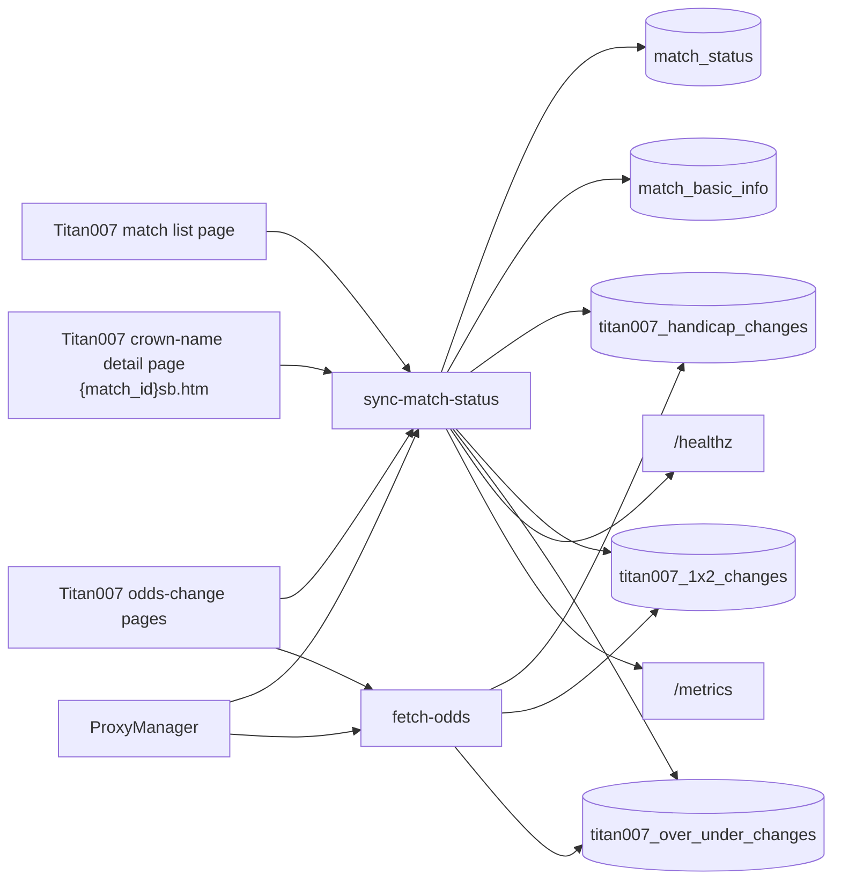
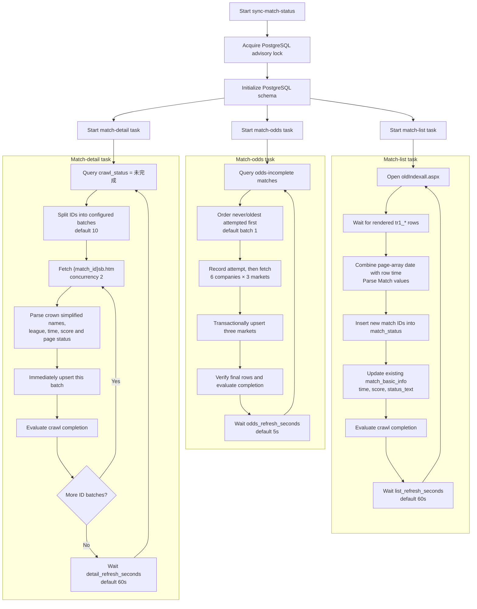
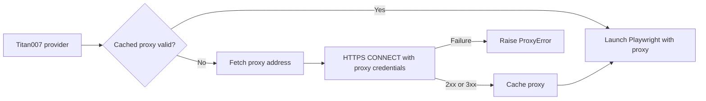
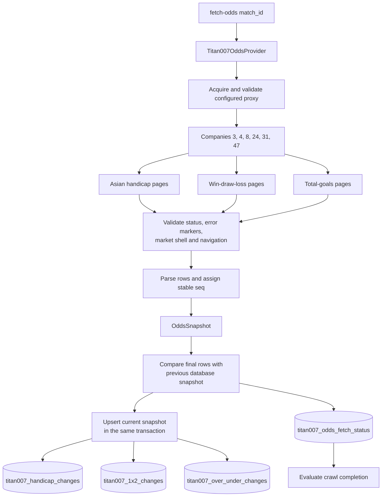

# Football2607 Code Flow

This document is the maintained map of the project's runtime logic. Update it in
the same change whenever workflows, background-task scheduling, data ownership,
database schemas, provider interfaces, or CLI entry points change.

## System overview



## Entrypoints

| Command | Python entrypoint | Purpose | Persistent write |
| --- | --- | --- | --- |
| `sync-match-status` | `fetch_data.status_cli:main` | Continuously synchronize match IDs, details, and odds | PostgreSQL |
| `fetch-odds` | `fetch_data.odds_cli:main` | Fetch and persist three odds markets for one match and selected companies | Three PostgreSQL odds tables |

## Continuous match synchronization

`MatchSynchronizer` starts three independent tasks. A slow detail or odds crawl
does not await or schedule the list refresh task.



### Field ownership

The three tasks deliberately own different updates so they do not overwrite one
another.

| Field | Initial insert | Subsequent owner |
| --- | --- | --- |
| `match_id` | Match-list task | Match-list task discovers new IDs |
| `crawl_status` | Database default `未完成` | Shared completion evaluator after list, detail, or odds writes |
| `source` | Detail task | Detail task |
| `league` | Detail task | Detail task |
| `home_team` / `away_team` | Detail task from `sb.htm` | Detail task |
| `scheduled_time` | Detail task initially, as `YYYY-MM-DD HH:MM` | Match-list task, combining the rendered page array's year/date with the row time; detail task only repairs legacy time-only values |
| `scheduled_at` | Derived from `scheduled_time` in Asia/Shanghai | Updated by whichever task owns the accepted `scheduled_time` value |
| `home_score` / `away_score` | Detail task initially | Match-list task |
| `status_text` | Detail task initially | Match-list task |
| `created_at` | Database default | Never changed after insert |
| `updated_at` | Database default | Refreshed by each successful row update |

`crawl_status` changes monotonically from `未完成` to `已完成` only when all three
conditions hold: `status_text = '完'`; the Asia/Shanghai scheduled time is at
least three hours in the past; and, after the match is finished, the latest row
from all three odds markets matches the persisted database row field-for-field
for companies `3`, `4`, `8`, `24`, `31`, and `47`. After the three-hour threshold,
an empty page passes only when the matching database market is also empty.

## Database schema

### `match_status`

This table is the match-ID and crawl-work queue. It does not store the football
match's current status.

```sql
CREATE TABLE match_status (
    match_id BIGINT PRIMARY KEY,
    crawl_status TEXT NOT NULL DEFAULT '未完成'
        CHECK (crawl_status IN ('未完成', '已完成')),
    created_at TIMESTAMPTZ NOT NULL DEFAULT NOW(),
    updated_at TIMESTAMPTZ NOT NULL DEFAULT NOW()
);
```

### `match_basic_info`

```sql
CREATE TABLE match_basic_info (
    match_id BIGINT PRIMARY KEY
        REFERENCES match_status(match_id) ON DELETE CASCADE,
    source TEXT NOT NULL,
    league TEXT NOT NULL,
    home_team TEXT NOT NULL,
    away_team TEXT NOT NULL,
    scheduled_time TEXT NOT NULL,
    scheduled_at TIMESTAMPTZ,
    home_score SMALLINT,
    away_score SMALLINT,
    status_text TEXT NOT NULL,
    created_at TIMESTAMPTZ NOT NULL DEFAULT NOW(),
    updated_at TIMESTAMPTZ NOT NULL DEFAULT NOW()
);
```

### Titan007 odds-change tables

`titan007_handicap_changes`, `titan007_1x2_changes`, and
`titan007_over_under_changes` store the three markets independently. Each table
uses `(match_id, company_id, seq)` as its primary key. `change_time` remains the
page's original `TEXT`; movement columns are constrained to `上升`, `下降`, or
`不变`. The full DDL is mirrored in
`fetch_data/migrations/003_titan007_odds_changes.sql`, the single schema source.
Runtime stores load packaged migrations through `fetch_data/schema.py`; they do
not contain DDL copies.

Every application-owned table has `created_at` and `updated_at` columns using
`TIMESTAMPTZ NOT NULL DEFAULT NOW()`. Inserts populate both defaults. Conflict
updates preserve `created_at` and explicitly refresh `updated_at`; match completion
and odds-attempt queue writes also refresh the affected row's `updated_at`.

`titan007_odds_fetch_status` records final-row verification separately from odds
rows. It has one row per match and company, with verification flags and latest
`seq` values for handicap, one-x-two, and over-under. Flags are written only for
post-match snapshots taken after the three-hour threshold whose latest page record
matches the previously persisted database record field-for-field, before the
current snapshot is upserted. A page and database
that are both empty also match. Six fully verified company rows are required by
the match completion evaluator; legacy coverage-only rows use an older verification
version and do not qualify.

## Proxy acquisition and validation

All three Titan007 providers share the same proxy lifecycle. `ProxyManager`
fetches one proxy address from the configured supplier, then validates it by
opening the configured HTTPS test URL before Playwright is launched. Because
HTTPS proxy authentication happens while establishing the CONNECT tunnel, the
validation request sends the configured Basic proxy credentials on the initial
CONNECT request. Only a 2xx or 3xx response is cached as a usable proxy. The
default cache lifetime is 60 seconds. Once it expires, the next provider request
obtains and validates a new address before launching its browser; an already-running
browser is not interrupted mid-crawl.



## Odds-change flow

For one match, the default request set is six companies multiplied by three
markets, for 18 pages.



The odds command initializes the three tables and upserts the successful company
snapshots in one transaction. Each company is atomic: all three market pages must
succeed or that company is omitted from the current snapshot. A failed company
does not prevent other complete companies from being stored. If every selected
company fails, collection fails without producing a snapshot. The command emits
only a human-readable count summary, including successful and failed company IDs,
not odds JSON. `OddsSnapshot.failed_companies` retains the per-company failure
reason for logs and callers; the persistence layer ignores failed companies.
Detailed field and DOM rules are maintained in
`docs/data-sources/titan007-odds-change-schema.md`.
When a company does not publish a market for the requested match, Titan007 renders
the navigation or market shell without the odds table. The provider accepts an
empty result only after validating HTTP status, error/block-page markers, and the
expected market structure. An empty market does not delete
rows already stored in PostgreSQL. After the match is finished and three hours
have elapsed, it satisfies verification only if the corresponding database market
is also empty.

## Module map

| Module | Responsibility |
| --- | --- |
| `fetch_data/models.py` | Match and odds domain values |
| `fetch_data/migrations/*.sql` | Single source of truth for PostgreSQL schema |
| `fetch_data/schema.py` | Packaged migration loader |
| `fetch_data/providers/titan007.py` | Rendered match-list collection and parsing |
| `fetch_data/providers/titan007_detail.py` | Crown simplified match-detail collection |
| `fetch_data/providers/titan007_odds.py` | Three-market odds-change collection and parsing |
| `fetch_data/odds_postgres.py` | Odds table initialization and transactional snapshot upserts |
| `fetch_data/match_completion.py` | Shared three-condition crawl completion rule |
| `fetch_data/proxy.py` | Proxy acquisition, validation, caching and rotation |
| `fetch_data/status_sync.py` | Independent list, detail, and odds task orchestration |
| `fetch_data/postgres.py` | Schema initialization, queries, transactions and upserts |
| `fetch_data/observability.py` | Metrics registry, Prometheus rendering, and health HTTP server |
| `fetch_data/status_cli.py` | Continuous synchronization composition root |
| `fetch_data/odds_cli.py` | One-shot odds CLI |

## Current operational constraints

- PostgreSQL advisory locking enforces one `sync-match-status` process. A second
  process exits instead of duplicating browser traffic.
- Titan007 commands require the proxy supplier variables documented in
  `FetchData/.env.example`; real credentials remain in the ignored `.env` file.
- `fetch-odds` also requires `DATABASE_URL`. The continuous synchronizer and the
  one-shot command use a separate odds-store PostgreSQL connection; the continuous
  process is still covered by its match-store advisory lock.
- Each task waits its configured interval after its current iteration finishes;
  the interval is not a wall-clock schedule.
- Detail pages have a 30-second timeout and are fetched with concurrency 2.
  Pending IDs are split into configurable batches (default 10), and each batch is
  persisted as soon as it finishes without waiting for the entire pending queue.
- The odds task defaults to one complete match per iteration and waits 5 seconds
  after the iteration finishes. It selects unfinished matches by oldest odds-status
  attempt (never-attempted first). An attempt updates queue recency without clearing
  verification flags even when page collection fails, so a bad or ongoing match
  cannot starve later IDs. Each match uses the provider's six-page concurrency to
  collect 18 pages.
- `sync-match-status` exposes `/healthz` and `/metrics` on `127.0.0.1:8080` by
  default. `--health-host` changes the bind address and `--health-port 0` disables
  HTTP. Metrics cover task attempts, failures and durations, page outcomes, detail
  and final-verification backlog, proxy refresh/validation/invalidation, and partial
  company failures.
- Matches remain in the detail queue until the status, three-hour threshold, and
  six-company final-odds verification conditions all hold. Completed matches are not
  selected by subsequent detail-task iterations.
- Packaged files under `fetch_data/migrations/` are the only PostgreSQL DDL source.
  Both stores load those resources at runtime, and package data configuration keeps
  them available in installed wheels.

## Documentation update checklist

Update this file whenever a change affects any of the following:

- a CLI command or entrypoint;
- a provider URL, selector, field mapping, or concurrency rule;
- task ordering, timing, retry, batching, or completion behavior;
- which task owns a database field;
- a table, column, constraint, index, or relationship;
- odds markets, companies, parsing rules, or persistence behavior.

When updating, revise the diagrams, tables, and operational constraints—not only
the prose description.
