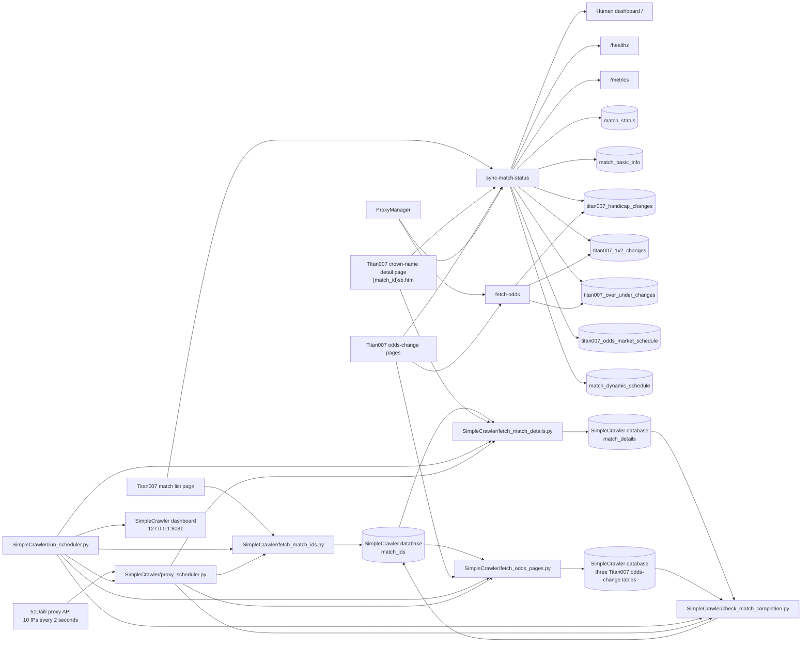
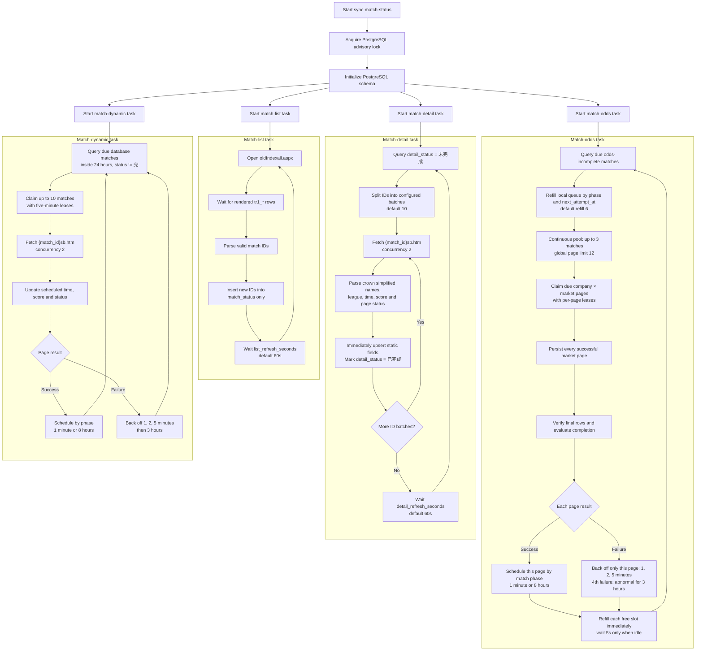
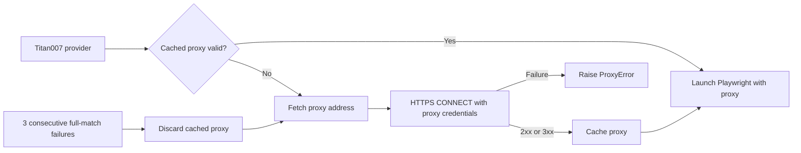
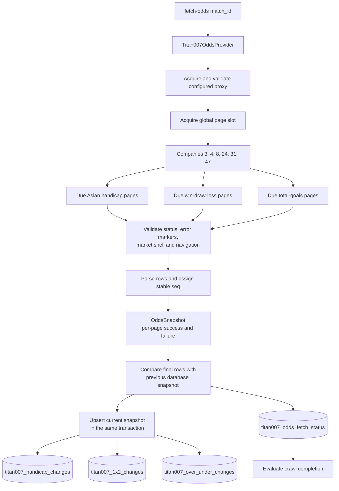

# Football2607 Code Flow

This document is the maintained map of the project's runtime logic. Update it in
the same change whenever workflows, background-task scheduling, data ownership,
database schemas, provider interfaces, or CLI entry points change.

## System overview



## Entrypoints

| Command | Python entrypoint | Purpose | Persistent write |
| --- | --- | --- | --- |
| `python3 SimpleCrawler/run_scheduler.py` | `SimpleCrawler/run_scheduler.py:main` | Run the proxy service and the four independent, single-instance crawler loops | None directly; child jobs own their writes |
| `python3 SimpleCrawler/fetch_match_ids.py` | `SimpleCrawler/fetch_match_ids.py:main` | Fetch the currently rendered Titan007 match IDs, print them, and store unseen IDs | Dedicated PostgreSQL database configured by `SIMPLE_CRAWLER_DATABASE_URL` |
| `python3 SimpleCrawler/fetch_match_details.py [match_id ...]` | `SimpleCrawler/fetch_match_details.py:main` | Fetch and store detail-page fields for selected IDs or every database ID | Dedicated PostgreSQL database configured by `SIMPLE_CRAWLER_DATABASE_URL` |
| `python3 SimpleCrawler/fetch_odds_pages.py [match_id ...]` | `SimpleCrawler/fetch_odds_pages.py:main` | Fetch, parse, and store three odds markets for each configured company and selected match | Dedicated PostgreSQL database configured by `SIMPLE_CRAWLER_DATABASE_URL` |
| `python3 SimpleCrawler/check_match_completion.py` | `SimpleCrawler/check_match_completion.py:main` | Re-fetch odds-page row counts for finished matches and mark stable matches complete | Updates `match_ids.crawl_status` in the dedicated PostgreSQL database |
| `python3 SimpleCrawler/proxy_scheduler.py` | `SimpleCrawler/proxy_scheduler.py:main` | Run the single localhost proxy-pool and lease service | In-memory proxy and lease state |
| `sync-match-status` | `fetch_data.status_cli:main` | Continuously synchronize match IDs, details, and odds | PostgreSQL |
| `fetch-odds` | `fetch_data.odds_cli:main` | Fetch and persist three odds markets for one match and selected companies | Three odds tables, verification status, and possibly match completion |

## Standalone match-ID discovery

`SimpleCrawler/run_scheduler.py` is the long-running supervisor for the standalone
crawler. A non-blocking process lock allows only one supervisor instance. It reuses
an already healthy proxy lease service or starts `proxy_scheduler.py`, then starts
four independent worker threads and one proxy-health sampling thread. The sampler
queries the proxy service `/health` endpoint every ten seconds and appends the pool,
lease, availability, page-slot, received, and validated counts to the proxy dashboard
log. A failed sample marks that panel unhealthy until the next successful sample.
Each worker runs its existing one-shot script as
a child process, captures its merged stdout/stderr while preserving prefixed terminal
output, waits for that child to finish, waits its post-round interval, and
only then starts the next round. Consequently, a slow round never overlaps the next
round of the same job, and no `--limit` is passed by the supervisor. Child processes
inherit the parent environment without adding `FetchData` to `PYTHONPATH`;
SimpleCrawler is independently installable from its own `pyproject.toml`.

The supervisor also owns a read-only human dashboard on `127.0.0.1:8081` by
default. `/` renders separate panels for the proxy service and all four jobs;
`/api/status` returns their current state, latest timing and exit information, and
the most recent 400 log lines per component. The browser polls once per second and
auto-scrolls active logs. `SIMPLE_CRAWLER_MONITOR_HOST` changes the bind address,
and `SIMPLE_CRAWLER_MONITOR_PORT=0` disables HTTP. State and logs are process-local
and disappear when the supervisor stops. An externally managed proxy service has
health state but only supervisor lifecycle messages because its stdout is not owned
by this process.

The default post-round intervals are 60 seconds for match-ID discovery, 5 seconds
for details, 5 seconds for odds, and 60 seconds for completion checks. They can be
overridden with `SIMPLE_CRAWLER_ID_INTERVAL_SECONDS`,
`SIMPLE_CRAWLER_DETAIL_INTERVAL_SECONDS`,
`SIMPLE_CRAWLER_ODDS_INTERVAL_SECONDS`, and
`SIMPLE_CRAWLER_COMPLETION_INTERVAL_SECONDS`. Odds and completion workers do not
share a lock and may run concurrently. The completion worker can therefore invoke
the one-shot `fetch_odds_pages.py <match_id>` child for an overdue match even while
the normal odds worker is active. SIGINT or SIGTERM stops active children and the
proxy service started by the supervisor. An independently managed healthy proxy
service is reused and left running.

`SimpleCrawler/fetch_match_ids.py` remains a one-shot entrypoint. It launches one
Chromium browser through a lease from the shared proxy service, waits for the
rendered `tr1_<match_id>` rows on `oldIndexall.aspx`, prints the unique positive
IDs in ascending order, inserts unseen IDs into its dedicated PostgreSQL database,
and exits.

The connection string comes only from `SIMPLE_CRAWLER_DATABASE_URL` in
`SimpleCrawler/.env`. The script creates `match_ids` on first use. Its `match_id`
column is the primary key, so repeated list fetches use `ON CONFLICT DO NOTHING`
and preserve the original `created_at` discovery time. `crawl_status` defaults to
`未完成` and is restricted to `未完成`, `已完成`, `暂停爬取`, or `异常`;
completion checks update it together with `updated_at`.

All standalone scripts take their persistent defaults from `SimpleCrawler/.env`.
`SIMPLE_CRAWLER_ACTIVE_CRAWL_STATUSES` is a comma-separated scope shared by the
detail, odds, and completion scripts and defaults to only `未完成`. Database-wide
selection and explicitly supplied match IDs are both filtered through this scope,
so `已完成`, `暂停爬取`, and `异常` do not re-enter those workflows by default. The
match-list script only discovers IDs and inserts unseen rows as `未完成`; conflicts
preserve the existing status.
The file configures the list and detail URLs, per-step timeouts, list settle delay,
optional detail limit, detail and odds page concurrency, headed mode, and mandatory
proxy supplier credentials. Explicit command line arguments override environment
defaults; `--headed` and `--headless` can override the configured browser mode in
either direction.

Every standalone network page must acquire a lease from
`SimpleCrawler/proxy_scheduler.py`; direct and fixed-proxy modes are not available.
The scheduler is one long-running localhost HTTP service and is the only process
that calls the supplier. It calls immediately and then every two seconds; each
response contributes up to ten `host:port` addresses to the one shared in-memory
pool only after validation. The ten candidates are checked concurrently through
their authenticated HTTPS proxy against `PROXY_TEST_URL`; only a 2xx or 3xx
response enters the pool. `/health` reports the latest received and validated
counts, distinct available proxies, and remaining page-assignment slots. An
address expires 30 seconds after its supplier request started and may be assigned
to at most five pages across all crawler processes, including five concurrent
browser contexts. The fifth assignment permanently retires that address; an
earlier page exception retires it immediately. Existing concurrent pages may
finish, but releases never restore consumed assignment slots, and later supplier
responses cannot re-add a retired address during the scheduler process lifetime.
Expired addresses and abandoned leases are reaped before another allocation.

The list, detail, odds, and completion scripts are lease clients only. They call
the configured `PROXY_SCHEDULER_URL` for `/lease` and `/release`, then create a
fresh proxy-bound Chromium context for each page. They never read
`PROXY_API_URL`, never maintain a local pool, and fail instead of crawling when
the central service is unavailable. Start `proxy_scheduler.py` before any crawler.

`SimpleCrawler/fetch_match_details.py` reads IDs from the same database. With
positional IDs it inserts unseen IDs and fetches only IDs whose status is in the
configured active-status scope; without positional IDs it applies that same scope
to `match_ids`. `--limit` optionally bounds either mode. One Chromium browser is
reused by a bounded worker queue. Up to
`SIMPLE_CRAWLER_DETAIL_CONCURRENCY` matches are active at once (default 2), and
each receives its own proxy lease, browser context, and page. Scripts remain
enabled because the detail page uses them to populate score and status; styles,
images, media, and fonts are blocked. Results are handled in completion order by
one database connection. Successful details are committed individually, so one
page failure does not discard other work.

The standalone `match_details` table owns league, home and away team, original
scheduled-time text, optional scores, and page status. `match_id` is both its
primary key and a cascading foreign key to `match_ids`; `created_at` records the
first successful detail fetch and conflict updates refresh `updated_at`.

`SimpleCrawler/fetch_odds_pages.py` reads active-status `match_ids` unless
positional IDs or `SIMPLE_CRAWLER_ODDS_MATCH_LIMIT` further restrict the run.
Positional IDs cannot bypass the active-status filter. Company IDs are configured
as a comma-separated list. Every match-company-market combination is one page job
in a bounded queue. One Chromium browser runs up to
`SIMPLE_CRAWLER_ODDS_PAGE_CONCURRENCY` jobs at once (default 4); every active job
has an independent proxy lease and browser context. Parsed results return in
completion order and are written serially through one database connection. Each
successful page is committed independently.

The standalone odds script owns its parser and field model under
`SimpleCrawler/simple_crawler`. This local module intentionally preserves the same
Titan007 row semantics as the main collector without importing `fetch_data`. It
writes the local company-name mapping in `simple_crawler/companies.py`; odds and
completion logs render both ID and name from this single interface. Every child
job prefixes output with its scheduler task name so interleaved concurrent logs
remain attributable. It
writes 亚让 to `titan007_handicap_changes`, 胜平负 to
`titan007_1x2_changes`, and 进球数 to `titan007_over_under_changes`. DOM order is
reversed into stable `seq` values, scores are split, red/green/no-color becomes
上升/下降/不变, 封 rows use null market fields, and raw plus numeric line values are
preserved. It does not add scheduling, retry state, or page-status tracking.
Before parsing, the script rejects HTTP errors and pages containing access-denied,
WAF, or CAPTCHA markers. A page without the target table is accepted as a valid
empty market only when the odds shell or market navigation is present; otherwise
it is a failure.

`SimpleCrawler/check_match_completion.py` remains one-shot; the supervisor provides
its 60-second post-round interval. It selects only rows in the configured
active-status scope, then keeps
finished matches plus non-finished matches whose parseable Asia/Shanghai scheduled
time is at least four hours in the past. Finished matches are ordered
first and checked across every configured company and all three markets. Only when
every page succeeds and every fetched row count equals the corresponding stored
table count does a finished match become `已完成`; a failed page or count mismatch
leaves it `未完成` for the next run. After those checks, the completion worker first
runs `SimpleCrawler/fetch_match_details.py <match_id>` for each overdue
non-finished match and reloads the stored page status. If the detail refresh fails,
the crawl status is left unchanged. If it updates the match to `完`, the match is
left active and deferred to the next completion round, where it enters the normal
finished-match odds verification path. Otherwise, the worker passes the match once
to `SimpleCrawler/fetch_odds_pages.py <match_id>` for a final odds refresh. A
successful final refresh marks it `暂停爬取`; any failed market page
produces a nonzero child result, but the match is still marked `暂停爬取` while failed
pages are at most half of all attempted pages. Only a strict majority of failed
pages marks the match `异常`. Configuration, database, browser, or child-process
failures that prevent a reliable page count do not update `crawl_status`, leaving
the match in its current active state for a later retry. Neither terminal status
re-enters the default active scope.

## Continuous match synchronization

`MatchSynchronizer` starts four independent tasks. List discovery, static detail,
dynamic match information, and odds collection do not wait for one another.



### Field ownership

The four tasks deliberately own different updates so they do not overwrite one
another.

| Field | Initial insert | Subsequent owner |
| --- | --- | --- |
| `match_id` | Match-list task | Match-list task discovers new IDs |
| `crawl_status` | Database default `未完成` | Shared completion evaluator after detail, dynamic, or odds writes |
| `detail_status` | Database default `未完成` | Detail task changes it to `已完成` after required static fields are stored |
| `source` | Detail task | Detail task |
| `league` | Detail task | Detail task |
| `home_team` / `away_team` | Detail task from `sb.htm` | Detail task |
| `scheduled_time` | Detail task initially | Dynamic task |
| `scheduled_at` | Detail task, derived in Asia/Shanghai | Dynamic task |
| `home_score` / `away_score` | Detail task initially | Dynamic task |
| `status_text` | Detail task initially | Dynamic task |
| `dynamic_updated_at` | Database default | Dynamic task |
| `created_at` | Database default | Never changed after insert |
| `updated_at` | Database default | Refreshed by each successful row update |

The detail task initializes time, score, and status from its first valid detail
page so newly discovered or already-finished matches immediately have a usable
snapshot. Static-detail conflict updates do not overwrite score or status. All
subsequent changes to these dynamic fields belong to the dynamic task.

`crawl_status` changes monotonically from `未完成` to `已完成` only when all three
conditions hold: `status_text = '完'`; the Asia/Shanghai scheduled time is at
least three hours in the past; and, after the match is finished, the latest row
from all three odds markets matches the persisted database row field-for-field
for companies `3`, `4`, `8`, `24`, `31`, and `47`. After the three-hour threshold,
an empty page passes only when the matching database market is also empty.

## Database schema

### `match_status`

This table is the match-ID and crawl-work queue. It does not store the football
match's current status.

```sql
CREATE TABLE match_status (
    match_id BIGINT PRIMARY KEY,
    crawl_status TEXT NOT NULL DEFAULT '未完成'
        CHECK (crawl_status IN ('未完成', '已完成')),
    detail_status TEXT NOT NULL DEFAULT '未完成'
        CHECK (detail_status IN ('未完成', '已完成')),
    created_at TIMESTAMPTZ NOT NULL DEFAULT NOW(),
    updated_at TIMESTAMPTZ NOT NULL DEFAULT NOW()
);
```

### `match_dynamic_schedule`

One row per match stores the dynamic-detail task's lease, next attempt, consecutive
failures, last success/error, and abnormal state. Successful work uses the same
phase cadence as odds: no work more than 24 hours before kickoff, an eight-hour
cadence that wakes five minutes before kickoff, and one-minute updates near kickoff
and while the match is not `完`. A finished match leaves this queue. Failures back
off after 1, 2, and 5 minutes; the fourth failure changes to a three-hour cadence.

### `match_basic_info`

```sql
CREATE TABLE match_basic_info (
    match_id BIGINT PRIMARY KEY
        REFERENCES match_status(match_id) ON DELETE CASCADE,
    source TEXT NOT NULL,
    league TEXT NOT NULL,
    home_team TEXT NOT NULL,
    away_team TEXT NOT NULL,
    scheduled_time TEXT NOT NULL,
    scheduled_at TIMESTAMPTZ,
    dynamic_updated_at TIMESTAMPTZ NOT NULL DEFAULT NOW(),
    home_score SMALLINT,
    away_score SMALLINT,
    status_text TEXT NOT NULL,
    created_at TIMESTAMPTZ NOT NULL DEFAULT NOW(),
    updated_at TIMESTAMPTZ NOT NULL DEFAULT NOW()
);
```

### Titan007 odds-change tables

`titan007_handicap_changes`, `titan007_1x2_changes`, and
`titan007_over_under_changes` store the three markets independently. Each table
uses `(match_id, company_id, seq)` as its primary key. `change_time` remains the
page's original `TEXT`; movement columns are constrained to `上升`, `下降`, or
`不变`. The full DDL is mirrored in
`fetch_data/migrations/003_titan007_odds_changes.sql`, the single schema source.
Runtime stores load packaged migrations through `fetch_data/schema.py`; they do
not contain DDL copies.

Every application-owned table has `created_at` and `updated_at` columns using
`TIMESTAMPTZ NOT NULL DEFAULT NOW()`. Inserts populate both defaults. Conflict
updates preserve `created_at` and explicitly refresh `updated_at`; match completion
and odds-attempt queue writes also refresh the affected row's `updated_at`.

`titan007_odds_fetch_status` records final-row verification separately from odds
rows. It has one row per match and company, with verification flags and latest
`seq` values for handicap, one-x-two, and over-under. Flags are written only for
post-match snapshots taken after the three-hour threshold whose latest page record
matches the previously persisted database record field-for-field, before the
current snapshot is upserted. A page and database
that are both empty also match. Six fully verified company rows are required by
the match completion evaluator; legacy coverage-only rows use an older verification
version and do not qualify.

### `titan007_odds_market_schedule`

This table is the retry and cadence state for the continuous odds queue. Its
primary key is `(match_id, company_id, market)`, so every institution-market page
owns its own `consecutive_failures`, `next_attempt_at`, `last_attempt_at`,
`last_succeeded_at`, `last_error`, `is_abnormal`, and `abnormal_since`. A
five-minute lease is written only for due pages claimed by the current collection.
Success schedules that page by match phase and clears only its failure state.
Failure retries only that page after 1, 2, and 5 minutes; the fourth consecutive
failure marks the page abnormal and subsequent attempts cool down for three hours.
The foreign key to `match_status` is added
when that table exists so the standalone `fetch-odds` command can still initialize
odds tables in isolation.

## Proxy acquisition and validation

All three Titan007 providers share the same proxy lifecycle. `ProxyManager`
fetches one proxy address from the configured supplier, then validates it by
opening the configured HTTPS test URL before Playwright is launched. Because
HTTPS proxy authentication happens while establishing the CONNECT tunnel, the
validation request sends the configured Basic proxy credentials on the initial
CONNECT request. Only a 2xx or 3xx response is cached as a usable proxy. The
default cache lifetime is 60 seconds. Once it expires, the next provider request
obtains and validates a new address before launching its browser; an already-running
browser is not interrupted mid-crawl.



The odds provider treats a collection as proxy-successful when at least one
claimed market page succeeds. When every claimed page fails, it reports one proxy
error even though the individual page failures remain in `OddsSnapshot` for
page-level retry. Reaching the configured proxy error threshold invalidates the
cached proxy; the continuous synchronizer additionally forces and validates a new
proxy after three consecutive full-match failures.

## Odds-change flow

For one match, the default request set is six companies multiplied by three
markets, for 18 pages. A single provider-level semaphore is shared by concurrent
matches, so the configured page concurrency is a process-wide limit rather than
a per-match multiplier.



The odds command initializes the three tables and upserts every successful market
page in one transaction. An institution-market page is the atomic persistence
and retry unit: a failed over-under page does not discard successful handicap or
win-draw-loss data from the same institution. `OddsSnapshot.market_results`
retains each attempted page's success or failure reason, including successful
empty markets. The continuous queue schedules successful pages normally and
retries only failed pages; the one-shot command reports page counts and does not
write retry state.
Detailed field and DOM rules are maintained in
`docs/data-sources/titan007-odds-change-schema.md`.
When a company does not publish a market for the requested match, Titan007 renders
the navigation or market shell without the odds table. The provider accepts an
empty result only after validating HTTP status, error/block-page markers, and the
expected market structure. An empty market does not delete
rows already stored in PostgreSQL. After the match is finished and three hours
have elapsed, it satisfies verification only if the corresponding database market
is also empty.

## Module map

| Module | Responsibility |
| --- | --- |
| `SimpleCrawler/simple_crawler/companies.py` | Standalone Titan007 company IDs, names, and log labels |
| `SimpleCrawler/simple_crawler/models.py` | Standalone odds-change domain values |
| `SimpleCrawler/simple_crawler/odds_parser.py` | Standalone Titan007 row validation and three-market parsing |
| `SimpleCrawler/simple_crawler/monitoring.py` | Bounded runtime state plus the local monitoring dashboard and JSON endpoint |
| `SimpleCrawler/pyproject.toml` | SimpleCrawler package metadata and complete runtime dependency declaration |
| `fetch_data/models.py` | Match-detail and odds domain values |
| `fetch_data/migrations/*.sql` | Single source of truth for PostgreSQL schema |
| `fetch_data/schema.py` | Packaged migration loader |
| `fetch_data/providers/titan007.py` | Rendered match-list ID discovery |
| `fetch_data/providers/titan007_detail.py` | Crown simplified match-detail collection |
| `fetch_data/providers/titan007_odds.py` | Three-market odds-change collection and parsing |
| `fetch_data/odds_postgres.py` | Due-work selection, odds retry scheduling, and transactional snapshot upserts |
| `fetch_data/match_completion.py` | Shared three-condition crawl completion rule |
| `fetch_data/proxy.py` | Proxy acquisition, validation, caching and rotation |
| `fetch_data/status_sync.py` | Independent list, static-detail, dynamic-detail, and odds task orchestration |
| `fetch_data/postgres.py` | Schema initialization, queries, transactions and upserts |
| `fetch_data/observability.py` | Human dashboard, metrics registry, Prometheus rendering, and health HTTP server |
| `fetch_data/status_cli.py` | Continuous synchronization composition root |
| `fetch_data/odds_cli.py` | One-shot odds CLI |

## Current operational constraints

- PostgreSQL advisory locking enforces one `sync-match-status` process. A second
  process exits instead of duplicating browser traffic.
- Titan007 commands require the proxy supplier variables documented in
  `FetchData/.env.example`; real credentials remain in the ignored `.env` file.
- `fetch-odds` also requires `DATABASE_URL`. The continuous synchronizer and the
  one-shot command use a separate odds-store PostgreSQL connection; the continuous
  process is still covered by its match-store advisory lock.
- The list and static-detail tasks wait their configured interval after each
  iteration. Dynamic and odds tasks keep draining due database work and wait their
  configured idle interval only when no work is due. None uses a wall-clock schedule.
- Match-list, match-detail, and odds pages each have a 10-second page timeout.
  Detail pages are fetched with concurrency 2.
  Only `detail_status = 未完成` IDs enter the static-detail queue. IDs are split
  into configurable batches (default 10), and each successful batch is persisted
  and marked `detail_status = 已完成` immediately.
- The list task only inserts newly discovered IDs. Static detail collection owns
  league and team fields and marks `detail_status = 已完成` after the first valid
  write. The dynamic task then selects its range entirely from PostgreSQL and owns
  scheduled time, score, and page status updates. It stops selecting a match once
  `status_text = 完`.
- The odds task only admits unfinished matches with stored basic information.
  Matches more than 24 hours before kickoff are excluded. Non-finished matches
  inside 24 hours are eligible; those within five minutes of kickoff or overdue
  are ranked first and use a one-minute success cadence, while ordinary pre-match
  work uses eight hours and is always woken five minutes before kickoff. Finished
  matches pause until `scheduled_at` is at least three hours old, then rank ahead
  of ordinary pre-match work for final-row
  verification. Live/near-kickoff work remains first so historical final backlog
  cannot starve current matches.
- Every institution-market page has independent cadence and retry state. Failed
  pages retry after 1, 2, and 5 minutes. The fourth consecutive failure marks only
  that page abnormal and schedules it three hours later; further failures remain
  on a three-hour cadence. A successful page resets only its own failure state.
  A five-minute in-progress lease covers claimed pages during process interruption,
  and queue metrics count matches with at least one page currently due.
- Three consecutive full-match failures trigger a forced proxy refresh and
  validation before new work fills freed slots. Full success or any page success
  resets this process-level counter; partial collection therefore does
  not misdiagnose a working proxy as globally unavailable.
- The odds task refills its local queue with up to six matches at a time and keeps
  up to three match jobs active. Completion of any one match immediately opens a
  slot for the next queued or newly queried match; a slow match never creates a
  whole-batch barrier. A hard per-match timeout defaults to 60 seconds, after
  which the job is cancelled and enters normal failure backoff. The task waits
  five seconds only when both the local queue and active pool are empty.
- All active matches share one provider-level page semaphore, with a default
  global maximum of 12 active odds pages. `--odds-batch-size`,
  `--odds-match-concurrency`, `--odds-match-timeout-seconds`, and
  `--odds-page-concurrency` configure queue refill, active matches, hard timeout,
  and page pressure independently.
- `sync-match-status` exposes a human-readable dashboard at `/`, JSON health at
  `/healthz`, and Prometheus metrics at `/metrics` on `127.0.0.1:8080` by default.
  The dashboard summarizes component health, task outcomes, latest durations, and
  pending queues, and refreshes every 10 seconds. `--health-host` changes the bind
  address and `--health-port 0` disables HTTP. Metrics cover task attempts,
  failures and durations, page outcomes, static-detail, dynamic, and odds backlog,
  proxy refresh/validation/invalidation, and partial company failures.
- Static details leave the detail queue immediately after a successful write;
  `crawl_status` and final odds verification no longer cause repeated detail fetches.
- Packaged files under `fetch_data/migrations/` are the only PostgreSQL DDL source.
  Both stores load those resources at runtime, and package data configuration keeps
  them available in installed wheels.

## Documentation update checklist

Update this file whenever a change affects any of the following:

- a CLI command or entrypoint;
- a provider URL, selector, field mapping, or concurrency rule;
- task ordering, timing, retry, batching, or completion behavior;
- which task owns a database field;
- a table, column, constraint, index, or relationship;
- odds markets, companies, parsing rules, or persistence behavior.

When updating, revise the diagrams, tables, and operational constraints—not only
the prose description.
